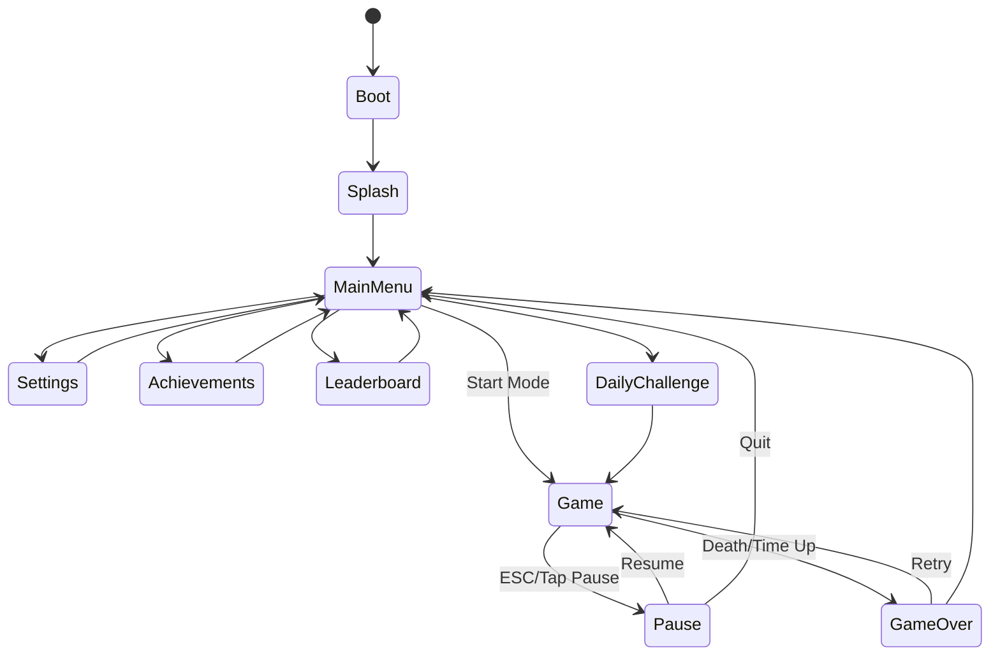

# NEON PULSE — Technical Architecture

## Overview
NEON PULSE uses a layered architecture with a thin game shell orchestrating PixiJS rendering, DOM-based UI overlays, and manager singletons injected via a service locator pattern.

```
┌─────────────────────────────────────────────────┐
│                   main.ts                        │
├─────────────────────────────────────────────────┤
│  Game (orchestrator)                             │
│  ├── SceneManager                                │
│  ├── InputManager                                │
│  ├── AudioManager                                │
│  ├── SaveManager                                 │
│  ├── AchievementManager                          │
│  ├── AnalyticsManager                            │
│  └── EventBus                                    │
├─────────────────────────────────────────────────┤
│  Scenes: Boot → Menu → Game → Pause → GameOver  │
├─────────────────────────────────────────────────┤
│  Gameplay Systems                                │
│  ├── SpawnerSystem                               │
│  ├── CollisionSystem                             │
│  ├── ComboSystem                                 │
│  ├── PowerupSystem                               │
│  ├── ParticleSystem                              │
│  └── DifficultySystem                            │
├─────────────────────────────────────────────────┤
│  UI Layer (DOM)                                  │
│  └── Screen components, HUD, modals              │
├─────────────────────────────────────────────────┤
│  PixiJS Stage (Canvas)                           │
│  └── Entities: Player, Obstacles, Shards, FX    │
└─────────────────────────────────────────────────┘
```

## Scene Flow



## Entity Definitions

| Entity | Components | Behavior |
|--------|-----------|----------|
| PlayerCore | Transform, Renderable, Collider, Player | Lane movement, phase state, trail |
| Firewall | Transform, Renderable, Collider, Obstacle | Scrolls down, blocks player |
| DataShard | Transform, Renderable, Collider, Collectible | Scrolls down, magnetizable |
| Powerup | Transform, Renderable, Collider, Powerup | Random type on spawn |
| Particle | Transform, Renderable, Lifetime | Pooled, auto-recycle |
| GridLine | Transform, Renderable | Parallax background |

## Physics Rules
- **Lanes**: 3 fixed lanes, player snaps with easing (200ms)
- **Scroll speed**: Base 300px/s, scales with difficulty (max 750px/s)
- **Hitbox**: Circle (player r=18px), AABB (obstacles)
- **Collision**: Broad phase by lane + Y proximity, narrow phase circle-rect
- **Phase shift**: Player hitbox layer changes; can pass through 1 firewall per activation

## Save Schema (v1)
```json
{
  "version": 1,
  "profile": { "name": "Pilot", "syncLevel": 1, "syncXP": 0 },
  "settings": {
    "masterVolume": 0.7, "sfxVolume": 0.8, "musicVolume": 0.5,
    "reducedMotion": false, "highContrast": false, "colorBlindMode": "none",
    "fontScale": 1.0, "theme": "dark", "controlSensitivity": 1.0
  },
  "stats": {
    "totalRuns": 0, "totalShards": 0, "totalScore": 0,
    "bestCombo": 0, "totalPlayTime": 0
  },
  "highScores": { "endless": 0, "timeAttack60": 0, "timeAttack120": 0, "challenge": 0 },
  "leaderboard": { "endless": [], "timeAttack60": [], "timeAttack120": [], "challenge": [] },
  "achievements": {},
  "unlocks": { "cores": ["cyan"], "trails": ["default"], "themes": ["default"] },
  "daily": { "lastPlayedDate": "", "streak": 0, "completedToday": false },
  "weekly": { "weekId": "", "completed": false, "bestScore": 0 }
}
```

## Event System
Typed event bus with categories: `game`, `ui`, `audio`, `save`, `analytics`.

Key events: `player:move`, `player:phase`, `shard:collect`, `combo:update`, `obstacle:hit`, `powerup:activate`, `score:change`, `game:over`, `achievement:unlock`.

## Input Mapping
Centralized in `InputManager` with configurable bindings. Supports pointer (tap zones), keyboard, and gamepad with debouncing and swipe detection.

## Performance Strategy
- Object pooling for particles, obstacles, shards
- Texture generation once at boot (RenderTexture cache)
- Minimal GC: reuse vectors, pre-allocated pools
- Lazy scene loading
- Single atlas for all procedural textures
- `requestAnimationFrame` game loop capped at 60 FPS
- Offscreen culling for entities below viewport

## Folder Structure
```
src/
├── main.ts
├── config/          # Game constants, balance tuning
├── core/            # Engine managers
├── scenes/          # Scene implementations
├── entities/        # Game objects
├── systems/         # Gameplay systems
├── ui/              # DOM UI components
├── audio/           # Procedural audio synthesis
├── graphics/        # Procedural texture generation
├── utils/           # Math, pool, easing helpers
└── types/           # TypeScript interfaces
docs/                # Design & planning documents
public/              # Static assets, PWA manifest icons
```

## Browser Compatibility
| Browser | Min Version | Notes |
|---------|------------|-------|
| Chrome | 90+ | Full support |
| Firefox | 90+ | Full support |
| Safari | 15+ | WebGL, touch |
| Edge | 90+ | Full support |
| Samsung Internet | 16+ | Touch optimized |

## Deployment
- Static build via `vite build`
- Deploy to any CDN/static host
- PWA service worker for offline play
- Target bundle: < 500KB gzipped (excluding PixiJS chunk)
